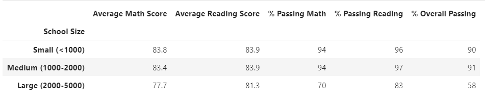

# School_District_Analysis
## Overview
The school board has notified Maria and her supervisor that the students_complete.csv file shows evidence of academic dishonesty; specifically, reading and math grades for Thomas High School ninth graders appear to have been altered. Although the school board does not know the full extent of the academic dishonesty, they want to uphold state-testing standards and have turned to Maria for help. She has asked you to replace the math and reading scores for Thomas High School with NaNs while keeping the rest of the data intact. Once you’ve replaced the math and reading scores, Maria would like you to repeat the school district analysis that you did in this module and write up a report to describe how these changes affected the overall analysis.
## Results: 

**How is the district summary affected?**

District summary before and after removing grade 9th data

`We can see from the above figures, the district summary was only slightly affected by this change.` 

**How is the school summary affected?**

School summary before and after removing grade 9th data

`And the same conclusion for "Thomas High School" school summary` 

**How does replacing the ninth graders’ math and reading scores affect Thomas High School’s performance relative to the other schools?**

`We still see Thomas high school in the second postion of the top 5 schools (by overall percantage)
before and after making the change`
Top 5 schools before and after removing the 9th graders

**How does replacing the ninth-grade scores affect the following:
Math and reading scores by grade?**

`As we see from the below figures, removing the 9th graders had no effect on the reports below` 

Scores by school spending before and after removing the 9th graders

Scores by school size before and after removing the 9th graders

Scores by school type before and after removing the 9th graders

